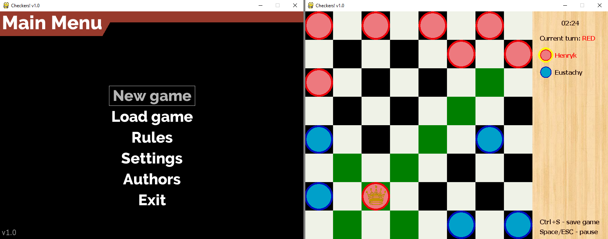
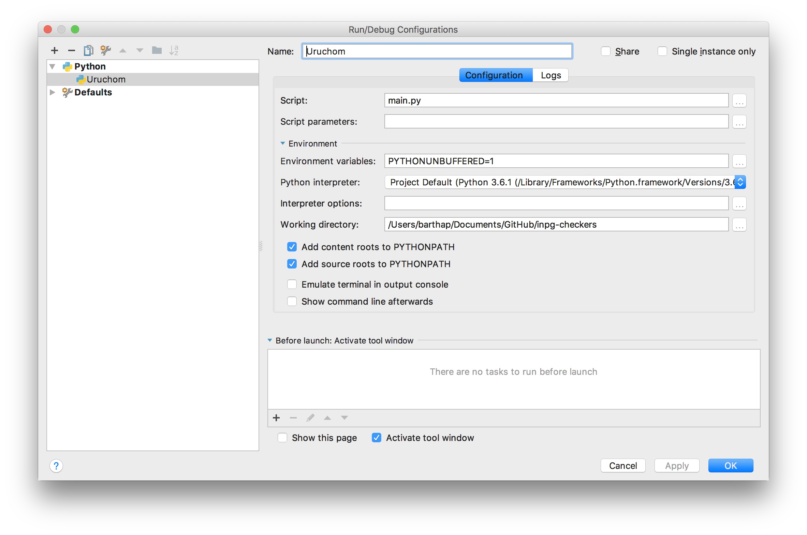

# INPG Checkers [](https://travis-ci.org/barthap/inpg-checkers)
A simple checkers game project for INPG (IT tools for team work)



## Dependencies:
Project uses following dependencies
1. **Python 3.6**: To install Python, download it from here: https://www.python.org/downloads/ 
2. **[PyGame](https://www.pygame.org/news)** - a library which make creating games with Python much easier. Install it with pip (Python package manager):
`pip install pygame`
3. **pygameMenu** - helper library for easy menu creation for pyGame. It's not available on pip
so you have to download it from [GitHub](https://github.com/ppizarror/pygame-menu), unrar and open cmd/terminal at its location (where setup.py is) and type 
`python setup.py install`
4. **[Pygame Text Input](https://github.com/Nearoo/pygame-text-input)**: A small module allowing
user to type player name. It is embedded into project in `src/utils/text.py`.

If you have all needed dependencies, clone the repo
```
git clone https://github.com/barthap/inpg-checkers.git
```

## How to run / build the game

#### 1. Running from executable

Go to the [latest relase page](https://github.com/barthap/inpg-checkers/releases) and download binaries,
then unrar the file and run `checkers.exe`

#### 2. Running from python interpreter

When you are in `inpg-checkers` directory, type
```
python src/main.py
```
Or run one of the following files:
- `play.bat` for Windows
- `./play` for Linux / Mac

#### 3. Building executable

**NOTE:** Currently, build script is working only on Windows.

You will need [PyInstaller](http://www.pyinstaller.org/) installed. Then just run `build.bat` on Windows.
The script will ask you if you want one big exe file
or directory with all libraries as separate files. When finished, your built game will appear in `dist` folder.

~~For Linux/OS X use `build.sh` script~~ _(not working yet)_

## PyCharm configuration
When you clone repository, in PyCharm select Open Project
and select repository folder (`inpg-checkers`). It should open it automatically.

To run project from IDE, you must create Run Configuration.
In top-right corner of IDE (next to green bug and play icon) select Edit Configurations.
Then create new configuration as shown on the screen:

Two fields are most important here:
- Script path: `src/main.py`, 
- Working Directory: location of `inpg-checkers` directory

To make PyCharm resolve `import` statements correctly, you should also mark `src` directory as source root.
Click RMB on `src` folder, then _Mark Directory as -> Source root_.

## Authors
- Barthap (me)
- [freestylofil](https://github.com/freestylofil)
- [mizeria298](https://github.com/mizeria298)
- [Ivurdaja](https://github.com/Ivurdaja)

## Roadmap
- Replace piece graphics
- Add Player vs AI game mode with different difficulties
- Add network multiplayer support

## Contribution
This is a student project for teamwork learning purposes. If you
have any suggestions, feel free to contribute. Issues and pull requests
are welcome ;)