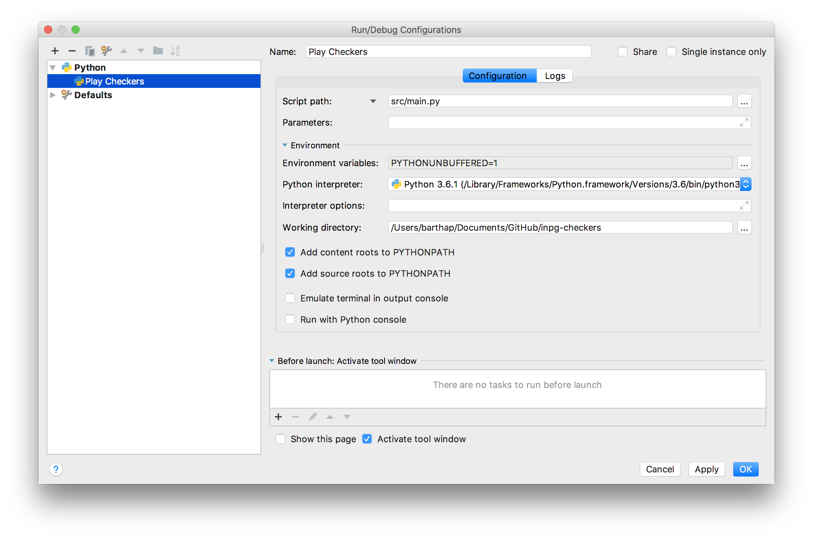

# INPG Checkers [](https://travis-ci.org/barthap/inpg-checkers)
A simple checkers game project for INPG (IT tools for team work)

### Installation:
Project uses following dependencies
1. **Python 3.6**: To install Python, download it from here: https://www.python.org/downloads/ 
2. **[PyGame](https://www.pygame.org/news)** - a library which make creating games with Python much easier. Install it with pip (Python package manager):
`pip install pygame`
3. **pygameMenu** - helper library for easy menu creation for pyGame. It's not available on pip
so you have to download it from [GitHub](https://github.com/ppizarror/pygame-menu), unrar and open cmd/terminal at its location (where setup.py is) and type 
`python setup.py install`

If you have all needed dependencies, clone the repo
```
git clone https://github.com/barthap/inpg-checkers.git
```

### How to run the game

When you are in `inpg-checkers` directory, type
```
python src/main.py
```
Or run one of the following files:
- `play.bat` for Windows
- `./play` for Linux / Mac

### PyCharm config
When you clone repository, in PyCharm select Open Project
and select repository folder (`inpg-checkers`). It should open it automatically.

To run project from IDE, you must create Run Configuration.
In top-right corner of IDE (next to green bug and play icon) select Edit Configurations.
Then create new configuration as shown on the screen:

Two fields are most important here:
- Script path: `src/main.py`, 
- Working Directory: location of `inpg-checkers` directory

### Authors
*TODO: Add Authors here* 

### Contribution
This is a student project for teamwork learning purposes. If you
have any suggestions, feel free to contribute. Issues and pull requests
are welcome ;)